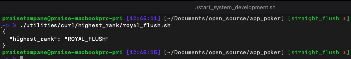
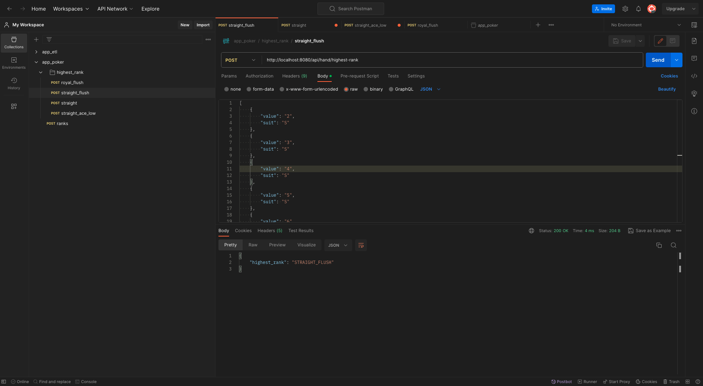

# app_poker
- a Poker hand evaluator.
    - currently only supports High Games:
        - features:
            - calculate highest hand rank possible for a 5 card hand.
            - calculate all possible hand ranks for a 5 card hand: **response is stubbed**

## project structure:
- docs: project documentation will live in here.
- src: production code lives in folder and is divided in the modules below:
    - app_poker: project package
        - api:
            - the API to the application lives in this module.
            - the current implementation is a REST API, but a gRPC, CLI API, etc would be implemented in here.
        - config:
            - configurable values live in here. 
            - these are values such as Hand Ranks, Card Ranks.
                - as the system scales, you could migrate these into a database to allow independently
                changing config without restarting the application.
        - core:
            - the domain logic of the application lives in this module.
        - gateway:
            - all external interaction objects(e.g. files, external APIs etc) live in this module.
        - model:
            - the domain models for Poker live in this in this module.
        - app.py:
            entry point to startup the application
- tests: test code lives in folder.
    the tests are intentionally separated from production code.
    - benefits:
        - tests can run against an installed version after executing `pip install .`.
        - tests can run against the local copy with an editable install after executing `pip install --edit`.
        - when using Docker, the entire app_poker folder can be copied without needing to exclude tests, which we don't release to PROD.
    - more in depth discussion here: https://docs.pytest.org/en/latest/explanation/goodpractices.html#choosing-a-test-layout-import-rules

- utilities: any useful scripts, such as curl & postman requests, JSON payloads, software installations, etc.

## setup instructions:
1. install `python 3.11` or higher.
    - Python download: https://www.python.org/downloads/

2. clone repo: 
    ```shell
    git git@github.com:praisetompane/app_poker.git
    ```
## package management:
- install pipenv: https://pypi.org/project/pipenv/
- to install packages into local environment:
    ```shell
    pipenv install
    ```
## run program:
- install packages into local environment[**only required for first run**]:
    ```shell
    pipenv install
    ```
- to start system run:
    ```shell
    ./start_system.sh
    ```

## testing:
### unit tests:
- to run tests:
    ```shell
    pipenv shell
    pytest
    ```
### end to end tests:
- The curl request used can be found in `utilities/curl/`.
    - example:
    ```shell
    ./utilities/curl/highest_rank/royal_flush.sh 
    ```
     <br>
- If you prefer Postman, the requests collection is in the `/utilities/postman/app_poker.postman_collection.json`.
    - Guide for how to import into Postman: https://learning.postman.com/docs/getting-started/importing-and-exporting/importing-data/
    

## development:
- to run system in debug mode:
    ```shell
    ./start_system_development.sh
    ```
## git conventions:
- **NB:** the master is locked and all changes must come through a Pull Request.
- commit messages:
    - provide concise commit messages that describe what you have done.
        ```shell
        # example:
        git commit -m "feat(core): algorithm" -m"implement my new shiny faster algorithm"
        ```
    - screen shot of Githb view
    - references: 
        - https://www.conventionalcommits.org/en/v1.0.0/
        - https://www.freecodecamp.org/news/how-to-write-better-git-commit-messages/
## demo:
### 0. start system output: <br>


### 1. evaluate hand output: <br>

### 2. stop system output:<br>

**Disclaimer**: This is still work in progress.# app_poker
