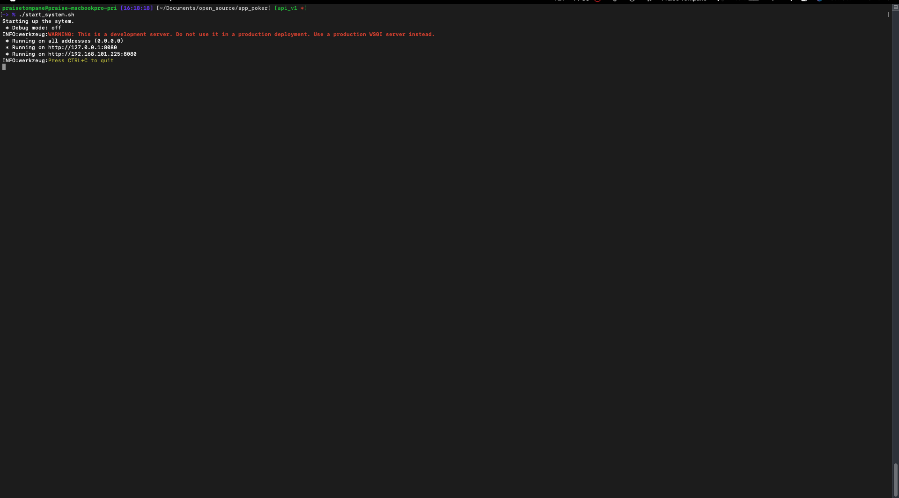

# app_poker
- a Poker hand evaluator.
    - currently only supports Standard High Games with Wild cards:
        - features:
            - calculate highest hand rank possible for a 5 card hand.

## project structure:
- docs: project documentation will live in here.
- src: production code lives in folder and is divided in the modules below:
    - app_poker: project package
        - api:
            - the API to the application lives in this module.
            - the current implementation is a REST API, but a gRPC, CLI API, etc would be implemented in here.
        - config:
            - configurable values live in here. 
            - these are values such as Hand Ranks, Card Ranks.
                - as the system scales, you could migrate these into a database to allow independently
                changing config without restarting the application.
        - core:
            - the domain logic of the application lives in this module.
        - gateway:
            - all external interaction objects(e.g. files, external APIs etc) live in this module.
        - model:
            - the domain models for Poker live in this in this module.
        - app.py:
            entry point to startup the application
- tests: test code lives in folder.
- utilities: any useful scripts, such as curl & postman requests, JSON payloads, software installations, etc.

## setup instructions:
1. Ensure you have `python 3.12` installed.
    - Python download: https://www.python.org/downloads/

2. clone repo: 
    ```shell
    git git@github.com:praisetompane/app_poker.git
    ```
## run program:

1. to start system run:
    ```shell
    ./start_system.sh
    ```

2. to stop the system run:
    ```shell
    ./stop_system.sh
    ```

## package management:
- install pipenv: https://pypi.org/project/pipenv/
- to install packages into local environment:
    ```shell
    pipenv install
    ```

## testing:
- to run tests:
    ```shell
    pipenv shell
    PYTHONPATH=src/ pytest
    ```
## git conventions:
- **NB:** the master is locked and all changes must come through a Pull Request.
- commit messages:
    - provide concise commit messages that describe what you have done.
        ```shell
        # example:
        git commit -m "feat(core): algorithm" -m"implement my new shiny faster algorithm"
        ```
    - screen shot of Githb view
    - references: 
        - https://www.freecodecamp.org/news/how-to-write-better-git-commit-messages/
        - https://www.conventionalcommits.org/en/v1.0.0/
## demo:
### 0. start system output: <br>


### 1. evaluate hand output: <br>

### 2. stop system output:<br>

**Disclaimer**: This is still work in progress.# app_poker
